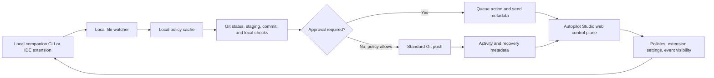

# Autopilot Product Audit

## Product premise

Autopilot CLI is a local Git automation concept intended to reduce routine version-control work by watching a repository, preparing changes, creating conventional commit messages, and optionally pushing approved work. Its published material already emphasizes protected branches, secret scanning, safe undo, local-first operation, and optional AI assistance. [1] [2]

The most valuable product direction is not to make automatic pushes more aggressive. It is to make automation **observable, policy-bound, reversible, and easy to pause**. Autopilot Studio is therefore designed as a safety-first control plane: the browser manages policy, visibility, and review; the companion stays on the developer’s machine and performs file watching and Git operations locally.

## Capability audit

| Area | Existing concept strength | Product gap | Studio response |
|---|---|---|---|
| Local Git automation | File monitoring, commits, and optional pushes reduce repetitive commands. | Users need confidence that automation is acting within clear limits. | Show live mode, branch scope, approval posture, and a one-click pause state. |
| Commit quality | Conventional commit messages and optional AI assistance improve history consistency. | Users need a reviewable queue before irreversible remote actions. | Add queued actions, commit review, explicit approval mode, and a complete event timeline. |
| Safety | Published safeguards include branch protection, secret checks, merge/rebase pausing, and no force pushes. [3] | Safety decisions need policy ownership and understandable evidence. | Add per-repository policies, secret-risk handling, ignored-path management, and reasoned alerts. |
| Recovery | The CLI includes an undo command. [3] | Users need a durable recovery history and clear operational boundaries. | Surface undo/revert controls, recovery records, and a recommendation to use Git-native history for remote recovery. |
| Visibility | CLI status and insights expose local information. | There is no unified view across repositories, extensions, policies, or incidents. | Build a searchable control center with repository posture, alert state, health signals, and activity records. |
| Extensibility | The CLI can evolve beyond its core watcher. | Integrations need lifecycle, permissions, configuration, and health monitoring. | Create a typed extension hub with capability scopes, enablement state, configuration panels, and attention indicators. |

## Product risks and controls

| Risk | Why it matters | Required control |
|---|---|---|
| Unwanted remote history | Automatic pushing can surprise collaborators or bypass review expectations. | Default to **review before push**, protect primary branches, and make push automation opt-in per repository. |
| Credential exposure | A commit may contain a secret, even unintentionally. | Block risky actions by default, show the detected-risk reason, and require a deliberate, auditable resolution path. |
| Lost local work | A failed or ill-timed automation step may affect the working tree. | Avoid operations during merge/rebase, expose queued actions, preserve event logs, and provide Git-native recovery guidance. |
| Confusing automation | Background behavior without visibility erodes trust. | Log every decision and show why an action ran, paused, was blocked, or needs review. |
| Extension overreach | IDE, Git-host, and notification extensions may request more access than needed. | Declare extension capabilities, show permissions, default new extensions to disabled, and monitor their health. |
| Alert fatigue | Too many notifications lead users to ignore important failures. | Keep alerts opt-in by category and default each category to off. |

## Local-first companion architecture

The companion receives a signed, scoped configuration snapshot and executes only local Git commands. It should never upload repository contents by default. The web application stores preference data, extension configuration, action metadata, and user-visible recovery records; it should store hashes, branch names, statuses, and summaries rather than source code. Any future Git-host integration should use narrowly scoped tokens, explicit permissions, and an extension-specific consent screen.

## Differentiators to pursue

Autopilot Studio should lead with **reviewable autonomy** rather than “push without thinking.” The primary user promise is: *you stay aware of every important automation decision, while the repetitive Git ceremony becomes quieter.* The differentiators are a transparent activity ledger, policy simulation before activation, extension capability boundaries, repository health guidance, and a recovery path users can understand before they need it.

## References

[1] [Autopilot CLI official website](https://autopilot-cli.praisetech.tech/)

[2] [Autopilot CLI Quick Start](https://autopilot-cli.praisetech.tech/docs/quick-start)

[3] [Autopilot CLI Safety Rails](https://autopilot-cli.praisetech.tech/docs/safety)
